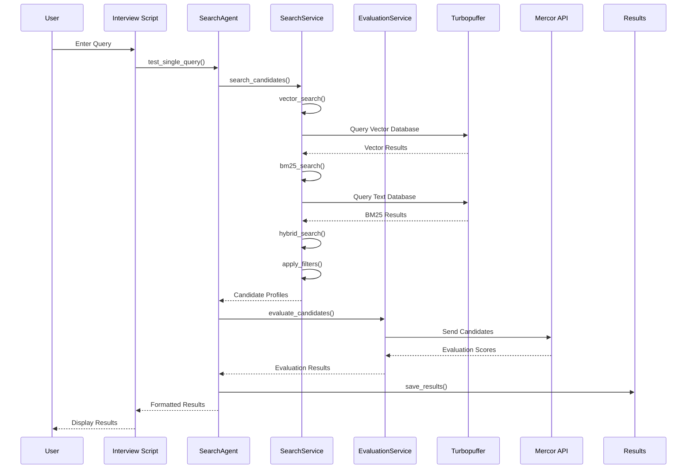
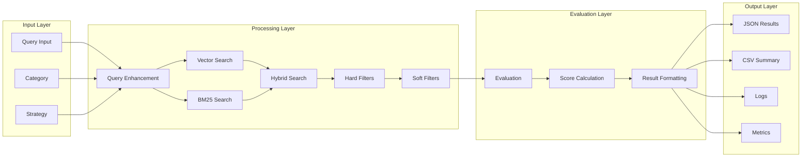
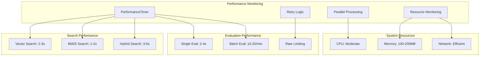
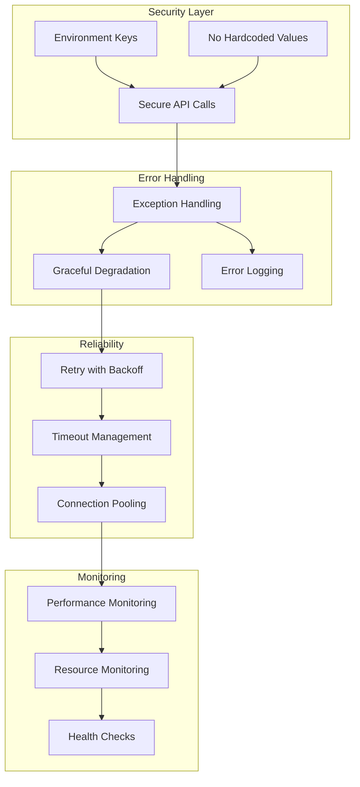

# 🏗️ Mercor Search Agent - Visual Architecture

## System Architecture Diagram

```mermaid
graph TB
    %% User Interface Layer
    subgraph "User Interface"
        UI[Interview Testing Script]
        UI --> |Interactive Mode| INT[Interactive Testing]
        UI --> |Single Query| SQ[Single Query Testing]
        UI --> |Batch Mode| BM[Batch Testing]
    end

    %% Main Application Layer
    subgraph "Main Application"
        MA[Main Application<br/>main.py]
        SA[SearchAgent Class]
        MA --> SA
        SA --> |run_evaluation| SEARCH_SVC
        SA --> |save_results| RESULTS
    end

    %% Configuration Layer
    subgraph "Configuration"
        CONFIG[Settings<br/>settings.py]
        API_CONFIG[API Configuration]
        SEARCH_CONFIG[Search Parameters]
        JOB_CONFIG[Job Categories]
        CONFIG --> API_CONFIG
        CONFIG --> SEARCH_CONFIG
        CONFIG --> JOB_CONFIG
    end

    %% Service Layer
    subgraph "Services"
        SEARCH_SVC[Search Service<br/>search_service.py]
        EVAL_SVC[Evaluation Service<br/>evaluation_service.py]
        EMBED_SVC[Embedding Service<br/>embedding_service.py]
        
        SEARCH_SVC --> |vector_search| VECTOR[Vector Search]
        SEARCH_SVC --> |bm25_search| BM25[BM25 Search]
        SEARCH_SVC --> |hybrid_search| HYBRID[Hybrid Search]
        SEARCH_SVC --> |apply_filters| FILTERS[Hard/Soft Filters]
        
        EVAL_SVC --> |evaluate_candidates| EVAL_API[Mercor Evaluation API]
        EVAL_SVC --> |format_summary| FORMAT[Result Formatting]
        
        EMBED_SVC --> |get_embeddings| VOYAGE[Voyage AI]
        EMBED_SVC --> |batch_embed| BATCH[Batch Processing]
    end

    %% External APIs
    subgraph "External APIs"
        TURBO[Turbopuffer<br/>Vector Database]
        VOYAGE[Voyage AI<br/>Embeddings]
        MERCOR[Mercor API<br/>Evaluation]
    end

    %% Data Models
    subgraph "Data Models"
        CP[CandidateProfile]
        SQ_MODEL[SearchQuery]
        SR[SearchResult]
        ER[EvaluationResult]
        SS[SearchStrategy]
    end

    %% Utilities
    subgraph "Utilities"
        PT[PerformanceTimer]
        RL[Retry Logic]
        PP[Parallel Processing]
        FO[File Operations]
        LOG[Logging]
    end

    %% Results & Output
    subgraph "Results & Output"
        RESULTS[Results Management]
        JSON_OUT[JSON Results]
        CSV_OUT[CSV Summaries]
        LOGS[Log Files]
        METRICS[Performance Metrics]
        
        RESULTS --> JSON_OUT
        RESULTS --> CSV_OUT
        RESULTS --> LOGS
        RESULTS --> METRICS
    end

    %% Connections
    UI --> MA
    MA --> CONFIG
    SEARCH_SVC --> TURBO
    SEARCH_SVC --> VOYAGE
    EVAL_SVC --> MERCOR
    EMBED_SVC --> VOYAGE
    
    SEARCH_SVC --> CP
    SEARCH_SVC --> SQ_MODEL
    SEARCH_SVC --> SR
    EVAL_SVC --> ER
    SEARCH_SVC --> SS
    
    SEARCH_SVC --> PT
    SEARCH_SVC --> RL
    SEARCH_SVC --> PP
    EVAL_SVC --> PT
    EVAL_SVC --> RL
    EVAL_SVC --> LOG
    
    MA --> RESULTS
    SEARCH_SVC --> RESULTS
    EVAL_SVC --> RESULTS

    %% Styling
    classDef serviceClass fill:#e1f5fe,stroke:#01579b,stroke-width:2px
    classDef apiClass fill:#f3e5f5,stroke:#4a148c,stroke-width:2px
    classDef modelClass fill:#e8f5e8,stroke:#1b5e20,stroke-width:2px
    classDef utilClass fill:#fff3e0,stroke:#e65100,stroke-width:2px
    classDef configClass fill:#fce4ec,stroke:#880e4f,stroke-width:2px
    classDef resultClass fill:#f1f8e9,stroke:#33691e,stroke-width:2px

    class SEARCH_SVC,EVAL_SVC,EMBED_SVC serviceClass
    class TURBO,VOYAGE,MERCOR apiClass
    class CP,SQ_MODEL,SR,ER,SS modelClass
    class PT,RL,PP,FO,LOG utilClass
    class CONFIG,API_CONFIG,SEARCH_CONFIG,JOB_CONFIG configClass
    class RESULTS,JSON_OUT,CSV_OUT,LOGS,METRICS resultClass
```

## Data Flow Diagram

## Component Interaction Diagram

## Performance Flow

## Security & Reliability Architecture

These diagrams provide a comprehensive visual representation of your Mercor Search Agent architecture, showing the relationships between components, data flow, performance characteristics, and security/reliability features. 